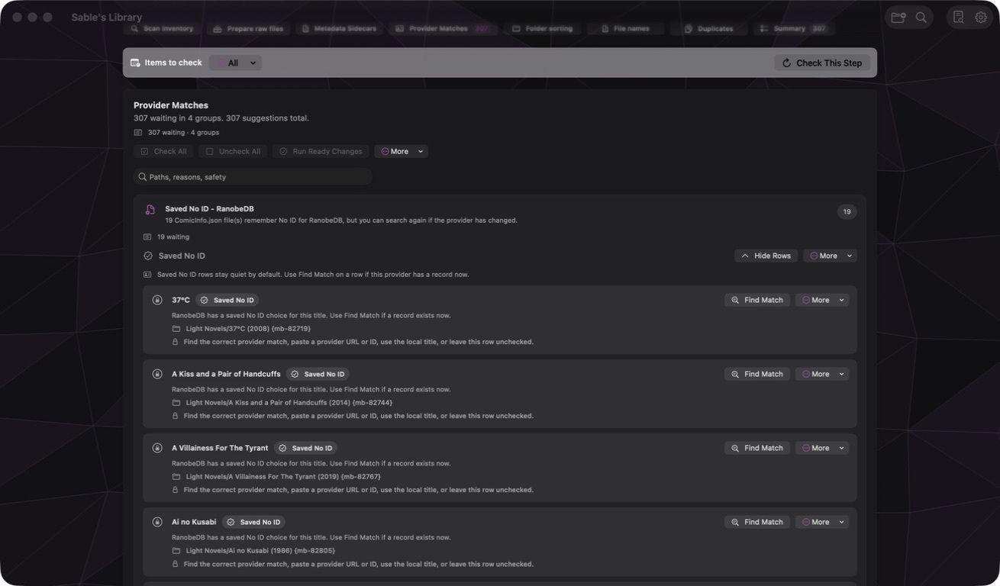
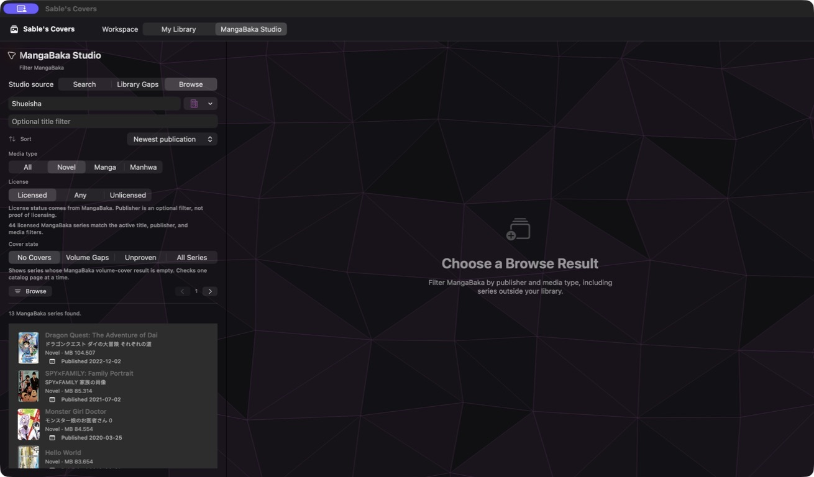
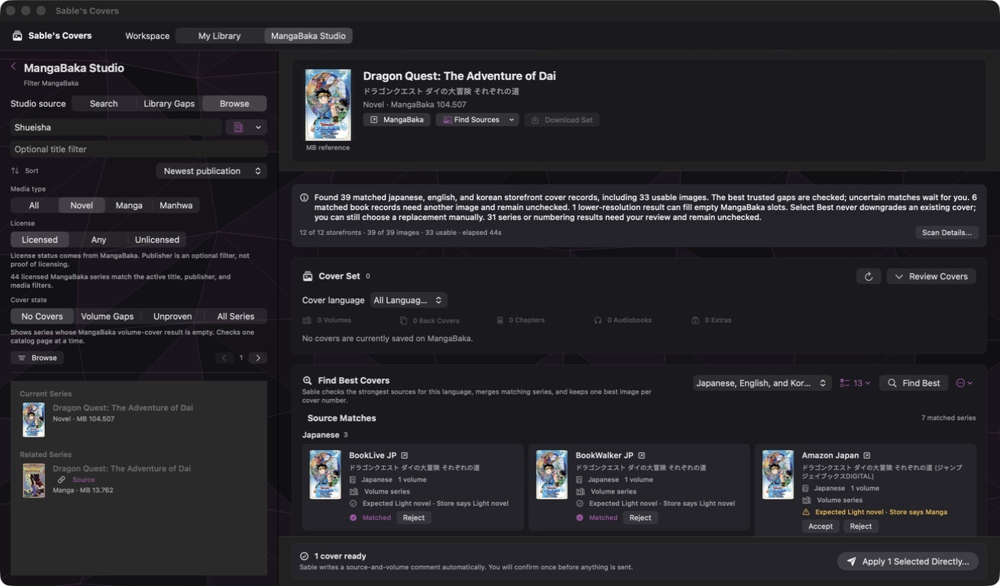

# Sable's Apps

Sable is a native macOS app family for maintaining ebook, manga, comic, and light-novel libraries with review before change.

This repository contains three apps in one Xcode project:

| App | Purpose |
| --- | --- |
| **Sable's Library** | Inspects and organizes a folder-based reading library, prepares metadata and naming changes, and writes receipts for applied work. |
| **Sable's Clinic** | Checks EPUB structure and content, explains repairable problems, and applies selected repairs. |
| **Sable's Covers** | Finds provider cover families, compares them with MangaBaka, prepares additions or upgrades, and supports contributor mapping and submission. |

All three apps are built around the same rule: **inspect first, show the proposed result, and change only what the user confirms.**

## Screenshots

### Sable's Library



### Sable's Clinic


### Sable's Covers

| Browse MangaBaka | Review and compare sources |
| --- | --- |
|  |  |

## Platform

Sable is a SwiftUI macOS project. It currently requires a recent Xcode and macOS SDK matching the deployment target in the project.

There is no Windows build. The file-analysis and provider logic could be extracted into a cross-platform core later, but the current interface, Keychain storage, security-scoped folder access, Apple Books integration, and `.icon` assets are native Apple implementations.

## Get the source

```bash
git clone https://github.com/AnneAruki/Sables-Apps.git
cd Sables-Apps
open "Sable's Library.xcodeproj"
```

Available schemes:

```text
Sable's Library
Sable's Clinic
Sable's Covers
```

Choose your own Apple development team in Xcode under **Signing & Capabilities**. The three apps share settings through an app-group identifier derived from the signing prefix. If you change the bundle identifiers, update the shared app-group suffix consistently for all three targets.

## Build and test

List the schemes:

```bash
xcodebuild -list -project "Sable's Library.xcodeproj"
```

Build one app:

```bash
xcodebuild \
  -project "Sable's Library.xcodeproj" \
  -scheme "Sable's Covers" \
  -configuration Debug \
  -destination "platform=macOS" \
  build
```

The local helper accepts `library`, `clinic`, or `covers`:

```bash
./script/build_and_run.sh covers
```

Run the shared test suite:

```bash
xcodebuild test \
  -project "Sable's Library.xcodeproj" \
  -scheme "Sable's Library" \
  -configuration Debug \
  -destination "platform=macOS"
```

Generated builds, Xcode user data, local environment files, signing material, and test results are ignored by Git.

## Sable's Library

Library turns a large folder into a reviewable maintenance workflow.

It can:

- Inspect names, paths, formats, package structure, local sidecars, and duplicate evidence without moving files.
- Prepare folder and book-file naming changes.
- Create or refresh local `ComicInfo.json` and `AnimeInfo.json` metadata.
- Separate clear work from ambiguous, colliding, network-backed, or destructive work.
- Apply checked rows and write summaries, reports, and an undo plan inside `_Sable's Library Reports`.
- Restore the last supported move when the original path remains free.

Library never treats a checked box as permission to bypass a safety conflict. Existing destinations, ambiguous identity, and destructive duplicate actions require explicit handling.

Most configurable cleanup rules live in:

```text
Sable's Library/App/sable_library_config.json
```

## Sable's Clinic

Clinic focuses on EPUB health instead of library naming.

It can:

- Run a fast structural inventory or a deeper content check.
- Inspect package files, navigation, CSS, images, page boxes, and related EPUB evidence.
- Separate safe repairs from issues that need review.
- Stop after the current unit of work and report partial progress.
- Apply selected repairs without mixing cover discovery into the repair pass.

Full checks can be CPU- and disk-intensive on large libraries. Start with a focused folder when testing, keep a backup of important books, and review the proposed repair set before applying it.

## Sable's Covers

Covers is a contributor helper, not an autonomous scraper or uploader.

The main workflow is:

1. Choose a MangaBaka series or audit a local series that needs cover work.
2. Search Big Book Covers and supported storefronts with the title that matches each provider language.
3. Review provider series grouped by language and media type. Confirm unknown relationships; reject clearly wrong manga, novel, chapter, or audiobook families.
4. Let Sable merge accepted families by language, cover type, and number.
5. Compare each best candidate with MangaBaka's current image dimensions and content rating.
6. Keep the suggested primary image, choose another provider, or include additional editions in the same slot.
7. Add an optional note, correct a number or rating, and stage only the missing or better covers.
8. Review the generated contributor comment and confirmation before applying.
9. Share confirmed mappings and number corrections back to Roler when signed in.

Chapter serial markers such as `分冊版`, `単話版`, `マイクロ版`, `単話売り`, `ばら売り`, and `連載版` are treated as chapter evidence. Repeated chapter artwork is reduced to the earliest useful chapter because MangaBaka does not need every repeated copy.

### Provider behavior

[Big Book Covers](https://covers.roler.dev/) is the primary provider-family and image source. Sable also uses exact store pages where they help prove media type, numbering, or a manually confirmed relationship.

Provider websites, APIs, HTML, anti-scraping controls, rate limits, and catalogs can change without a Sable update. A missing result does not prove that a publication does not exist. The manual series/book URL and direct cover-link tools remain available for that reason.

Cover images and store metadata remain the property of their publishers, creators, retailers, and other rights holders. Users are responsible for following provider terms and the rules of the destination service.

## Accounts and API access

The repository ships with **no production credentials**.

Optional credentials are entered by each user in app Settings and stored in the macOS Keychain:

- **MangaBaka personal access token** for contributor snapshots, preview, and apply.
- **Roler sign-in** for confirmed series mappings and volume-number corrections.
- **TMDB and TVDB credentials** for optional metadata work outside Covers.

Public and no-key sources may still receive the title or provider identifier needed for an explicit search. Sable does not upload a user's entire library to a provider.

Never commit tokens, sessions, personal reports, or real library paths. See [SECURITY.md](SECURITY.md).

## Data sources

Sable can interact with third-party services including:

- [MangaBaka](https://mangabaka.org/data/api) for series metadata and contributor cover operations.
- [Big Book Covers](https://covers.roler.dev/) for provider matching and cover discovery.
- BookLive, BookWalker, Amazon, Audible, Barnes & Noble, YES24, Kyobo, RIDI, and other storefronts supported by the current provider code.
- [RanobeDB](https://ranobedb.org/api/docs/v0), [AniList](https://anilist.gitbook.io/anilist-apiv2-docs), [Open Library](https://openlibrary.org/developers/api), Wikidata, TVmaze, TMDB, and TVDB for optional metadata evidence.

Their availability, licensing, rate limits, and terms are independent of this project. Provider results are evidence for review, not guaranteed facts.

## Privacy and safety

Local by default:

- Folder inspection and file analysis.
- Naming and metadata review.
- Duplicate grouping.
- EPUB checks and repairs.
- Local learning and generated receipts.

Explicit network work:

- Metadata searches selected by the user.
- Cover-provider searches.
- MangaBaka contributor preview and apply.
- Roler mapping and correction sharing.

Important file operations use previews and checked rows. Sable does not automatically delete duplicate books or overwrite an occupied destination. Keep a separate backup anyway: this is evolving software that works with valuable personal files.

## App icons

Each app uses a modern Icon Composer source instead of a folder of exported PNG sizes:

```text
Sable's Library/AppIcon.icon
Sable's Library/ClinicFirstAidAppIcon.icon
Sable's Library/CoversAppIcon.icon
```

Open these in Apple's Icon Composer or edit them through a compatible Xcode version. The Library, Clinic, and Covers targets reference their own icon source and color identity.

## Project layout

```text
Sable's Library.xcodeproj
Sable's Library/
  App/
    Core/
    Covers/
    Design/
    Scanners/
    Services/
    Settings/
    Steps/
    Views/
  AppIcon.icon/
  ClinicFirstAidAppIcon.icon/
  CoversAppIcon.icon/
Sable's LibraryTests/
docs/
script/
```

## Contributing

Read [docs/CONTRIBUTING.md](docs/CONTRIBUTING.md) before changing file operations, contributor submissions, restore behavior, provider authentication, or automatic selection rules.

Useful contributions improve:

- File safety and reversibility.
- Accessibility and keyboard use.
- Clearer uncertainty and recovery states.
- Provider parsing fixtures and deterministic classification.
- Faster review without hiding alternatives.
- Native macOS behavior and performance.

Use synthetic fixtures. Do not include real personal libraries or credentials in tests and issues.

## License

Sable's source code is available under the [MIT License](LICENSE). Third-party metadata, cover images, trademarks, and provider content keep their own terms and licenses.
