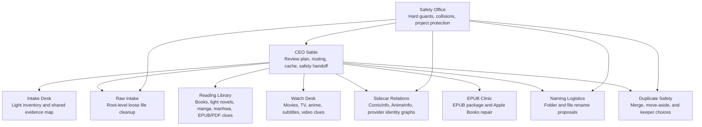

# Sable ML

Sable uses a small local Core ML ensemble trained on review choices, training receipts, and safe filename/file-type clues.

The app should treat ML as an assistant, not as an autopilot. Deterministic safety checks, collisions, protected project folders, provider gates, and explicit review choices still win.

## Bundled Model Suite

The app project contains a non-private starter suite:

- `App/ML/SableLibraryDecisionClassifier.mlmodel`
- `App/ML/SableLibraryInspectionClassifier.mlmodel`
- `App/ML/SableLibraryRawCleanupClassifier.mlmodel`
- `App/ML/SableLibraryReadingClassifier.mlmodel`
- `App/ML/SableLibraryProviderClassifier.mlmodel`
- `App/ML/SableLibraryTitleAliasRoleClassifier.mlmodel`
- `App/ML/SableLibraryMediaTypeClassifier.mlmodel`
- `App/ML/SableLibraryTagRoleClassifier.mlmodel`
- `App/ML/SableLibraryDescriptionAboutnessClassifier.mlmodel`
- `App/ML/SableLibraryWorkFamilyRelationshipClassifier.mlmodel`
- `App/ML/SableLibrarySidecarClassifier.mlmodel`
- `App/ML/SableLibraryShelfClassifier.mlmodel`
- `App/ML/SableLibraryEvidenceMeetingClassifier.mlmodel`
- `App/ML/SableLibraryEPUBRepairClassifier.mlmodel`
- `App/ML/SableLibraryNamingMoveClassifier.mlmodel`
- `App/ML/SableLibraryReadingNameTagger.mlmodel`
- `App/ML/SableLibraryVideoNameTagger.mlmodel`
- `App/ML/SableLibraryDocumentNameTagger.mlmodel`
- `App/ML/SableLibraryReviewActionRecommender.mlmodel`
- `App/ML/SableLibraryProviderRankingRecommender.mlmodel`
- `App/ML/SableLibraryFolderGroupingRecommender.mlmodel`

The decision classifier is the coordinator. The other models are specialists:

- Inspection: local folder walks, sidecar coverage, duplicates, and repair candidates.
- Raw cleanup: typed drawers, project-folder protection, PDFs, documents, images, audio, archives, video, and loose reading files.
- Reading: prose books, novels, light novels, manga, manhwa, manhua, OEL, comics, EPUBs, PDFs, and comic archives.
- Provider: local-vs-network choices and MangaBaka, RanobeDB, Open Library, and watching provider evidence.
- Title/alias role: primary titles, alternate titles, romanized titles, native titles, and provider title variants.
- Media type: manga, manhwa, manhua, OEL, comics, prose books, novels, and light novels.
- Tag role: genre, setting, narrative engine, subject/theme, relationship, demographic, form/noise, adaptation/status, and advisory vocabulary.
- Description aboutness: story-engine description clues, thin-description warnings, and shelf-bearing text.
- Work-family relationship: provider series identity, aliases, form-specific versions, adaptations, and related works.
- Sidecar: ComicInfo, AnimeInfo, JSON reads/writes, metadata cleanup, and provider match strength.
- Shelf: SSS aboutness-first main shelves and sub-shelves.
- Evidence meeting: confidence, review state, competing shelves, missing evidence, and training-vs-review signals.
- EPUB repair: package repair, Apple Books compatibility, cover metadata, fixed layout, image optimization, and import metadata.
- Naming/moves: folder grouping, file renames, duplicate review, and final-path confidence.
- Reading word tagger: title, year, volume, chapter, provider-noise, edition, and extension spans.
- Video word tagger: title, season, episode, year, resolution, codec, source, language, subtitle, and extension spans.
- Document word tagger: PDF/document type, date, edition/version, title-ish, and extension spans.
- Review action recommender: likely check, skip, protect, treat-as, merge, rename, and provider-choice hints.
- Provider ranking recommender: Open Library, RanobeDB, manga/comic providers, and watching providers by context.
- Folder grouping recommender: reading, watching, document, media, archive, and protected-project grouping hints.

The provider specialist also learns `providerShape.*` lessons from provider dumps. That keeps provider dump structure inside the provider department instead of adding a separate visible model just for source shape.

## Company Operating Model

Sable's ML system is organized like a small company with role clarity, short handoffs, and safety vetoes:



The organization rules are deliberately boring in the best way:

- One owner per row. A cleanup suggestion has a clear department owner, with advisors named in review notes.
- Shared evidence first. The light inventory builds one evidence map so departments do not all re-scan the same folder.
- Specialists wake lazily. Raw cleanup, sidecars, EPUB repair, videos, and naming only do deeper work when their review lane opens.
- Safety has veto power. Protected projects, apps, games, package folders, symlink escapes, collisions, and unclear merges stay out of quiet apply even if ML likes the idea.
- Psychological safety for the user. Uncertain rows ask for review, weak provider matches skip, and corrections become training signals instead of treated like mistakes.
- After-action learning. Checked rows, corrections, provider choices, and skips can feed local training, but anonymous project training strips titles and paths into feature tokens.

## Lazy Specialist Flow

Sable should not wake every model during the first look. The pipeline uses a light inventory first, then deepens only for the active review step:

1. Light inventory maps paths, file types, sidecars, safety markers, and obvious reading/watching clues.
2. The active step wakes its specialists: raw cleanup, reading/EPUB, provider/sidecar, folder naming, file naming, or duplicates.
3. Apply checked safe rows only.
4. Post-apply quick check refreshes changed paths for the active lane; other lanes wake only when opened.

Runtime Core ML loading follows the same rule. Classifiers are loaded lazily when a stage asks for a hint instead of being compiled all at once at app startup.
Runtime model hints include company tokens such as `department.rawintake`, `owner.sidecarrelations`, `safety.veto`, `trust.providerboundary`, and `communication.stagedhandoff`. These are anonymous coordination signals, not private titles or paths.

## Training Material

Sable treats review work as training material before it treats it as model truth.

The best lessons are:

- corrections such as Treat as Book, Treat as Light Novel, Treat as Document, Move to Videos, Move to Images, or Keep Local
- checked safe rows that apply successfully
- manual provider IDs for MangaBaka, RanobeDB, Open Library, AniList, TVmaze, Wikidata, TMDB, TVDB, or IMDb
- skipped weak provider matches and rows left unchecked because they were unclear
- large raw-cleanup batches that were sampled and corrected before Check Safe

For very large raw intake batches, Sable should mark the batch as training material first. The rows stay unchecked so the user can review a sample, correct odd rows, and then use Check Safe only after the pattern looks trustworthy. This prevents a giant mixed folder from becoming a noisy lesson.

The local app records training events into the selected library reports folder as `_sable_ml_training_events.jsonl`. Those events use stable path hashes and feature summaries rather than raw full paths, but they can still describe local behavior. Keep report folders local unless intentionally sharing them.

Normal users can train a personal local decision model from Settings > Learning > Retrain from Local Data. That personal model is written to Application Support and used for local ML hints when local learning is on. It does not move, rename, upload, or overwrite user files.

For a fuller walkthrough, see `ML_TRAINING_MATERIAL.md`.

These models are safe to keep in the repository and bundle with the app. They can be trained in two safe ways:

- curated baseline examples only
- local library signals converted into anonymous feature tokens first

Regenerate the bundled baseline suite from the repo root:

```sh
script/train_sable_library_ml.swift --project-baseline
```

Train the bundled project suite from local Sable signals without committing titles or paths:

```sh
script/train_sable_library_ml.swift --project-anonymous
```

The baseline training CSV is written to temporary space by default so the repo root stays tidy. Pass `--dataset /path/to/file.csv` if you want to inspect that CSV.

## Personal Model

The local trainer writes personal artifacts into the selected library reports folder by default:

- `_Sable's Library Reports/SableLibraryPersonalDecisionClassifier.mlmodel`
- `_Sable's Library Reports/SableLibraryPersonalDecisionClassifierTraining.csv`

These files can contain local library titles and learned tokens. Keep them local unless you deliberately want to share that dataset.

Open any `.mlmodel` in Xcode to inspect the model metadata, input, and output. The current model input is `text`; the predicted output is `label`.
The `.mlmodel` is an exported Core ML model, not an editable Create ML project document. Create ML trains and exports it; Xcode previews and compiles it into the app.

Xcode can upgrade the file to `.mlpackage`, but that is optional here. Keep `.mlmodel` while the training script is the source of truth. Use `.mlpackage` later if Sable needs package-only metadata editing, encryption, or larger model assets.

## Train It

From the repo root:

```sh
script/train_sable_library_ml.swift
```

By default this scans only `$HOME/Documents/Sable Library` when that folder exists.
Use `--scan-root` to choose any other training folder explicitly. This narrow default avoids unexpectedly reading unrelated files from Documents or Downloads.
Reading labels are balanced during training so a large light-novel batch does not drown out ordinary prose examples.

The trainer uses three evidence levels:

- Strong local memory from Teach Type, Teach Folder, PDF choices, local/provider sidecar choices, and manual provider IDs.
- Strong JSONL events from successful applied rows saved by Sable.
- Weak filename seeds from scan roots, only for obvious file-extension and volume-pattern cases.

Anonymous project training converts raw titles, paths, and IDs into privacy-preserving features such as extension, volume markers, year-like numbers, provider names, word-count buckets, task/stage tokens, sidecar tokens, and punctuation shape before Create ML sees the row. Runtime ensemble hints also use stage, operation, safety, extension, destination bucket, provider, and review tags instead of raw paths.

Video cleanup uses the same privacy path. Anonymous features include video extensions, season/episode markers, resolution and codec clues, subtitle sidecars, Plex-style provider IDs, and watching providers such as TMDB, TVDB, IMDb, AniList, TVmaze, and Wikidata.

Use a smaller `--max-weak-filename-seeds` while experimenting. The default is 900 weak filename seeds, shared across the scan roots. Use `--no-weak-filename-seeds` when you want a model trained only from direct Sable choices and curated seed examples.

## Training Sessions

Useful training sessions are small and deliberate:

- Inspect a mixed folder and apply only the rows that are obviously right. Those successful rows teach the inspection, raw cleanup, naming, provider, sidecar, and EPUB specialists.
- Use correction buttons such as Treat as Document, Treat as Book, Treat as Light Novel, Move to Videos, Move to Images, and Keep Local. These are stronger than weak filename seeds.
- Fix provider IDs manually when MangaBaka, RanobeDB, Open Library, AniList, TVmaze, Wikidata, TMDB, TVDB, or IMDb need help. Manual IDs become provider training events.
- Leave uncertain rows unchecked. Skipping weak guesses is useful because the deterministic safety layer learns where review is needed.
- Re-train with `--project-anonymous` after a batch of good corrections if you want the bundled project suite to improve without adding private names.

Do not train the bundled project suite from raw private titles. Use anonymous project training for anything that might be committed.

## Provider Dump Workshop

MangaBaka and RanobeDB can both be used as broad reading-library baselines, but Sable should not scrape public pages for this job. Prefer official database dumps for full-corpus analysis, and use public APIs only for smaller smoke tests, precise ID lookups, or targeted refresh.

Provider dump data should be treated as a workshop, not final truth. It is good for learning provider shape, title/alias patterns, media types, tag vocabulary, public genre patterns, description language, release language coverage, provider overlap, and common weak-evidence cases. It is not enough by itself for high-confidence aboutness when descriptions are thin, when a famous series changes engine over time, or when local/user preference matters.

Preferred provider roles:

- MangaBaka: broad manga, manhwa, manhua, OEL, light-novel, and cross-provider identity evidence. Prefer the JSONL or SQLite dumps for local indexing. Read `genres_v2` and `tags_v2` before older fallback fields so Sable learns the current provider vocabulary, including tag paths, spoiler/adult flags, and explicit genre-vs-tag structure. Use the full dump only when raw upstream responses are needed for audit or repair.
- RanobeDB: deep Japanese light-novel identity, series/book/release structure, volume descriptions, publishers, staff, ISBNs, and official release metadata. Prefer the daily PostgreSQL dump for full-corpus analysis; use the read-only API for small smoke tests and targeted enrichment.
- Local ComicInfo/user decisions: highest authority for local folder moves, shelf overrides, and personal retrieval preference.

Build an SSS audit/training JSONL sample from the repo root:

```sh
swiftc "Sable's Library/App/Core/SableLibraryShelfTagClassifier.swift" \
  "Sable's Library/App/Core/SableLibraryShelfCatalog.swift" \
  script/ranobedb_shelf_smoke.swift \
  -o /tmp/ranobedb_shelf_smoke

/tmp/ranobedb_shelf_smoke --count 300 \
  --output-jsonl /tmp/ranobedb-sss-corpus.jsonl
```

For a full API harvest, use `--all` only with caching and the default rate limit. Full detail enrichment can take a long time because RanobeDB asks API clients not to exceed 60 requests per minute.

For official dumps, build three layers of output:

- SSS audit/training files for shelf smoke tests.
- Broad company ML rows for reading type, provider routing, provider match strength, and metadata identity/detail.
- Workshop lesson files where each specialist gets a separate classroom.

```sh
swiftc "Sable's Library/App/Core/SableLibraryShelfTagClassifier.swift" \
  "Sable's Library/App/Core/SableLibraryShelfCatalog.swift" \
  script/provider_dump_shelf_corpus.swift \
  -o /tmp/provider_dump_shelf_corpus

tar -xOzf series.jsonl.tar.gz | /tmp/provider_dump_shelf_corpus \
  --mangabaka-jsonl - \
  --output-jsonl /tmp/sable-mangabaka-sss-corpus.jsonl \
  --output-csv /tmp/sable-mangabaka-sss-training.csv \
  --output-ml-csv /tmp/sable-mangabaka-company-training.csv \
  --output-workshop-dir /tmp/sable-mangabaka-workshop \
  --workshop-label-cap 1200 \
  --tag-role-row-limit 5000

gzip -dc rndb-db-public-latest.dump.gz | /tmp/provider_dump_shelf_corpus \
  --ranobedb-pgdump - \
  --output-jsonl /tmp/sable-ranobedb-sss-corpus.jsonl \
  --output-csv /tmp/sable-ranobedb-sss-training.csv \
  --output-ml-csv /tmp/sable-ranobedb-company-training.csv \
  --output-workshop-dir /tmp/sable-ranobedb-workshop
```

The workshop directory contains:

- `provider-shape.csv`: raw MangaBaka/RanobeDB shape lessons.
- `title-alias.csv`: primary title, aliases, and missing-alias lessons.
- `media-type.csv`: manga, manhwa, manhua, OEL, comic, light novel, and unknown media lessons.
- `tag-role.csv`: genre/theme/relationship/form/adaptation/status/advisory tag-role lessons.
- `description-aboutness.csv`: description presence, confidence, and shelf-bearing description evidence.
- `work-family.csv`: provider series, alias, form-specific version, and cross-media relationship lessons.
- `manager-meeting.csv`: confidence, actionability, review/training candidate, missing evidence, competing shelf lessons.
- `meeting-notes.jsonl`: one evidence-meeting record per provider row.
- `all-lessons.csv`: all specialist lesson rows together for capped sample training.

Then feed lessons into the trainer explicitly. Always cap dump rows per label until the label balance is audited:

```sh
script/train_sable_library_ml.swift --suite \
  --extra-csv-label-cap 1200 \
  --extra-csv /tmp/sable-mangabaka-company-training.csv \
  --extra-csv /tmp/sable-ranobedb-company-training.csv \
  --extra-csv /tmp/sable-mangabaka-workshop/all-lessons.csv \
  --extra-csv /tmp/sable-ranobedb-workshop/all-lessons.csv
```

For larger samples, train the suite in smaller department passes instead of asking one process to hold every specialist at once:

```sh
script/train_sable_library_ml.swift --suite \
  --only-model SableLibraryShelfClassifier \
  --extra-csv-label-cap 500 \
  --extra-csv /tmp/provider-workshop-training.csv
```

Keep full dump outputs out of the repo. They can contain provider text and large third-party metadata. Use them as local training material, then inspect the generated label counts before bundling a model.

Workshop curriculum rules:

- Chunk full MangaBaka runs before training. A broad sample is useful, but a single huge interpreted Swift/Create ML process can become memory-heavy.
- Specialists learn first. Managers should train from specialist meeting notes only after the specialist labels are sane.
- Low/review rows teach caution, not fake certainty.
- Provider truth is useful for explicit fields, but not final aboutness truth.
- MangaBaka produces many tag-role lessons, so cap and balance it.
- RanobeDB is excellent for light-novel identity/work-family lessons, but sparse raw-ID rows should not be forced into SSS shelf labels.
- Local user corrections outrank provider dump patterns.

## Current Labels

Labels are grouped by decision family:

- `inspect.localOnly`, `inspect.sidecarCoverage`, `inspect.duplicates`, `inspect.epubPackages`
- `task.rawCleanup`, `task.protectedRoot`, `task.move`, `task.folderRename`, `task.fileRename`, `task.duplicateReview`, `task.providerCall`, `task.jsonSidecar`, `task.epubRepair`
- `cleanup.document`, `cleanup.image`, `cleanup.audio`, `cleanup.archive`, `cleanup.watching`, `cleanup.reading`, `cleanup.other`
- `reading.book`, `reading.novel`, `reading.lightNovel`, `reading.manga`, `reading.manhwa`, `reading.manhua`, `reading.oel`, `reading.comic`
- `raw.documents.*`, `raw.images.*`, `raw.audio.*`, `raw.archives.*`, `raw.books.*`, `raw.video.*`
- `epub.repair.package`, `epub.repair.appleBooks`, `epub.repair.metadata`, `epub.repair.cover`, `epub.repair.fixedLayout`, `epub.repair.optimize`
- `sidecar.comicInfo.create`, `sidecar.comicInfo.refresh`, `sidecar.animeInfo.create`, `sidecar.animeInfo.refresh`, `sidecar.json.read`, `sidecar.json.write`
- `shelf.*` for SSS aboutness shelf/sub-shelf labels
- `providerShape.*`, `titleAlias.*`, `mediaType.*`, `tagRole.*`, `description.*`, `workFamily.*`, `manager.*` for provider dump workshop specialists
- `provider.callReading`, `provider.callWatching`, `provider.keepLocal`, `provider.matchStrong`, `provider.matchAmbiguous`
- `pdf.document`, `pdf.book`
- `provider.local`, `provider.mangabaka`, `provider.ranobedb`, `provider.openLibrary`
- `provider.tmdb`, `provider.tvdb`, `provider.imdb`, `provider.anilist`, `provider.tvmaze`, `provider.wikidata`
- `metadata.use`, `metadata.keep`

The app integration uses the ensemble as a review hint only. It must not bypass Sable's existing review, collision, provider, or safety gates.
