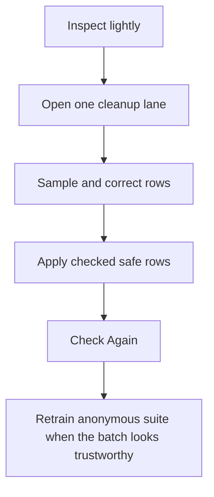

# Sable ML Training Material

Sable learns best from small, deliberate review sessions. The goal is not to accept every suggestion. The goal is to give each specialist a few clean examples of what good judgment looks like.

## What Counts

Good training material:

- A row you corrected before applying.
- A checked row that applied successfully.
- An offline EPUBCheck finding that led to a deterministic EPUB Clinic test or repair.
- A provider row where you entered the exact ID.
- A weak provider match you left unchecked or skipped.
- A big raw batch where you sampled a few rows before using Check Safe.

Not good training material:

- Applying a giant mixed batch just to see what happens.
- Checking rows that still feel confusing.
- Using private raw titles directly for bundled project training.
- Letting one folder style teach every library style.

## Training Sessions

Use short sessions by department:

- Raw Intake: loose root files, broad type folders, media homes, and project-folder protection.
- Reading Library: prose books, light novels, manga, manhwa, manhua, EPUB, PDF, CBZ, and volume cleanup.
- Watch Desk: movies, TV, anime, episodes, subtitles, quality tags, and provider IDs.
- Sidecar Relations: ComicInfo, AnimeInfo, local JSON, provider freshness, and keep-local choices.
- EPUB Clinic: package repair, Apple Books compatibility, cover metadata, fixed layout, and import metadata.
- Naming Logistics: folder grouping, file renames, final paths, duplicates, merge, and move-aside choices.
- Safety Office: projects, apps, games, package folders, Git repos, symlinks, collisions, and unclear merges.

## External EPUB Validation

EPUBCheck is an external validator from the W3C/DAISY EPUB standards ecosystem, not a bundled Sable dependency. Use it as a development and QA tool to inspect EPUB 2/3 package structure, OPF metadata, manifest references, navigation, NCX compatibility, and standards findings before deciding what Sable should repair.

Credit and standards context:

- EPUBCheck: https://github.com/w3c/epubcheck
- EPUBCheck releases and documentation: https://www.w3.org/publishing/epubcheck/
- EPUB 3.3 / 3.4 specifications: https://www.w3.org/TR/epub-33/ and https://www.w3.org/TR/epub-34/

Keep EPUBCheck output out of the user-facing app until Sable has a clear install story, credits, and calm failure states. For now, use findings offline to create focused regression tests and anonymous training labels such as metadata-refines repair, NCX identifier repair, navigation repair, or accessibility metadata review. EPUBCheck findings should inform deterministic repair code and ML routing; they should not become an automatic rewrite pass by themselves.

## Big Batch Rule

Huge raw batches should start as training material, not as a pile of pre-approved work.

Review a sample first:

1. Open the lane.
2. Check several rows from different parts of the list.
3. Correct wrong type, provider, number, or destination choices.
4. Leave uncertain rows unchecked.
5. Use Check Safe only when the visible pattern looks right.
6. Apply.
7. Check Again before opening the next lane.

## Privacy

The app writes local training events into:

```text
_Sable's Library Reports/_sable_ml_training_events.jsonl
```

Those events use stable path hashes and feature summaries instead of raw full paths. They are still local behavioral history, so keep report folders private.

Bundled project models should be regenerated with anonymous project training:

```sh
script/train_sable_library_ml.swift --project-anonymous
```

Anonymous training converts local text into feature tokens such as extension, stage, operation, safety, destination family, provider family, volume markers, episode markers, and review tags.

## What Updates Automatically

The running app can immediately use local learning memories and training events as hints.

The bundled `.mlmodel` files do not retrain after every apply. Retraining is an explicit step so CPU stays calm and private collection names do not get baked into the project by accident.

## Train From Settings

Normal users can retrain a personal local model from Settings:

1. Open Settings.
2. Go to Learning.
3. Choose Retrain from Local Data.
4. Confirm the warning.

This reads local training events and app learning memory, writes a personal decision model in Application Support, and does not move, rename, upload, or overwrite user files. Sable uses that personal model for local ML hints when local learning is on.

Project model promotion remains a development step:

```sh
script/train_sable_library_ml.swift --project-anonymous
```

## Best Cadence


